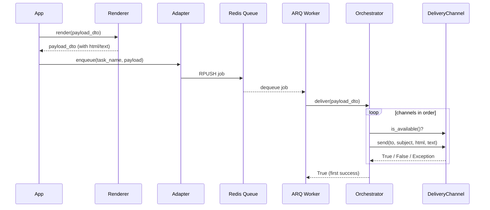

<!-- type: CONCEPT -->

[← Notifications](README.md) | [Home](../../index.md)

# Data Flow: Notifications

## Message Lifecycle

1. **Build** — App code constructs a `NotificationPayloadDTO` with recipient, subject, template name, and context data.

2. **Render** — `NotificationRenderer` loads the Jinja2 template, injects context, and populates `html_content` / `text_content` fields on the DTO.

3. **Enqueue** — `NotificationAdapter.enqueue()` is called with the serialized DTO:
   - `ArqDeliveryAdapter` pushes the job to a Redis queue via ARQ.
   - `DirectDeliveryAdapter` calls the orchestrator immediately in the current process.

4. **Orchestrate** — `BaseDeliveryOrchestrator.deliver()` iterates the registered channels:
   - Skips channels where `is_available()` returns `False`.
   - Calls `channel.send(to, subject, html, text)`.
   - On success → returns `True`, stops iteration.
   - On exception → logs, moves to next channel.
   - If all channels exhausted → logs error, returns `False`.

5. **Acknowledge** — If delivered via ARQ, the ARQ worker marks the job complete. No ACK needed for direct delivery.

## Sequence Diagram

## Error Paths

| Failure point | Behaviour |
| :--- | :--- |
| Renderer raises | Propagates to caller — payload is never enqueued |
| Adapter raises | Propagates to caller — infrastructure error, must not be swallowed |
| Channel raises | Logged, next channel tried |
| All channels fail | `deliver()` returns `False`, logged as error |
