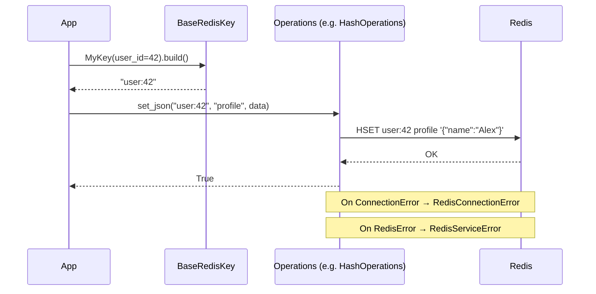
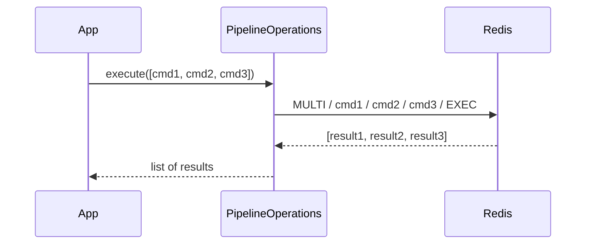

<!-- type: CONCEPT -->

[← Redis Service](README.md) | [Home](../../index.md)

# Data Flow: Redis Service

## Operation Lifecycle

1. **Key construction** — caller builds a typed key via a `BaseRedisKey` subclass. The key string is validated at construction time.

2. **Operation call** — caller invokes a method on the appropriate operations object (e.g., `service.hash.set_json(key, field, data)`).

3. **Serialization** — for JSON-capable methods, the operation serializes Python objects to JSON strings before writing to Redis.

4. **Redis call** — the operation executes the underlying `redis-py` coroutine (`xadd`, `hset`, `set`, etc.).

5. **Error handling** — any `ConnectionError` / `TimeoutError` raises `RedisConnectionError`; other `RedisError` raises `RedisServiceError`. No raw exceptions leak to callers.

6. **Deserialization** — on read, the operation deserializes raw Redis bytes/strings back to Python types.

## Sequence Diagram

## Pipeline Flow

For atomic multi-operation batches, `PipelineOperations` collects commands and flushes them in a single round-trip:

