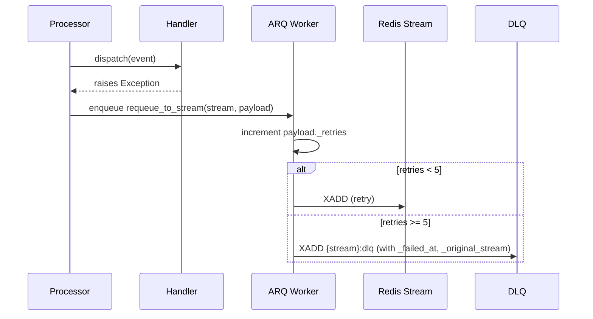
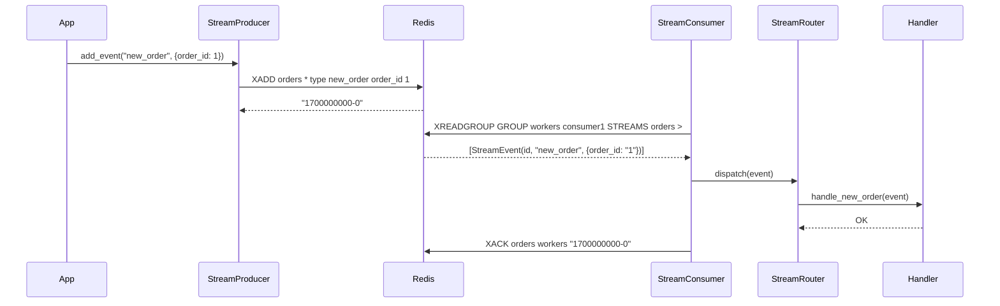

<!-- type: CONCEPT -->

[← Streams](README.md) | [Home](../../index.md)

# Data Flow: Streams

## Producer Flow

1. App constructs event data as a Python dict.
2. `StreamProducer.add_event(event_type, data)` sanitizes the payload (all values → `str`, `None` filtered out, `type` field injected).
3. `XADD {stream_name} * type {event_type} ...fields` is sent to Redis.
4. Redis returns the event ID (`{timestamp}-{seq}`).

## Consumer Flow

1. At startup, `StreamConsumer.ensure_group()` calls `XGROUP CREATE` (idempotent — skips if group exists).
2. `StreamConsumer.read(count)` calls `XREADGROUP GROUP {group} {consumer} COUNT {count} STREAMS {stream} >`.
3. Each raw message is parsed into `StreamEvent(id, event_type, data)`.
4. `StreamDispatcher` passes each event to `StreamRouter.dispatch(event)`.
5. `StreamRouter` looks up the handler by `event.event_type` and calls it.
6. On success → `StreamConsumer.ack(event.id)` → `XACK`.

## Retry / DLQ Flow

## Full Sequence

