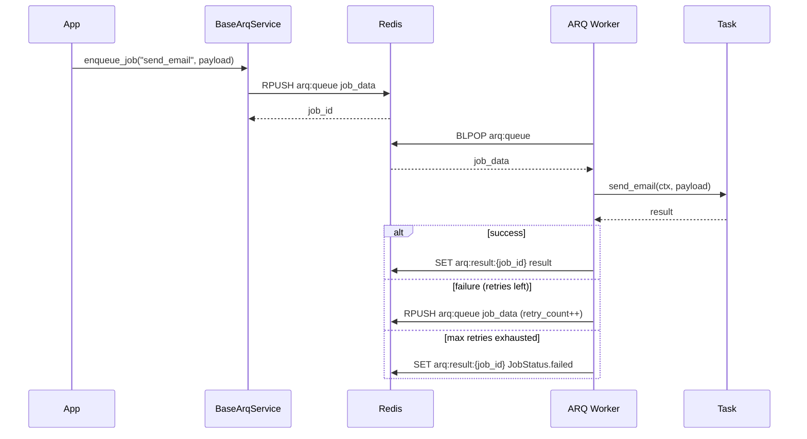
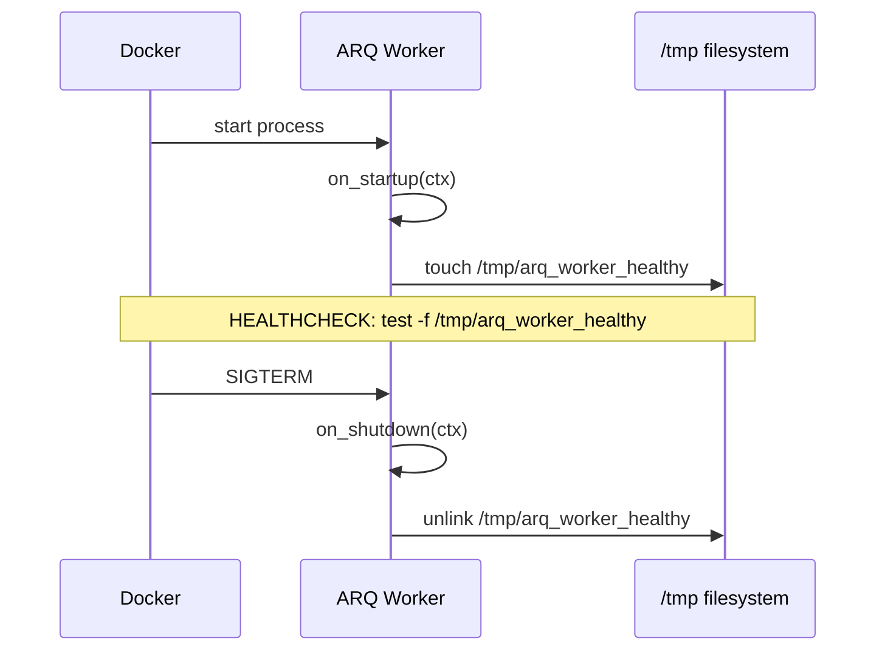

<!-- type: CONCEPT -->

[← Workers](README.md) | [Home](../../index.md)

# Data Flow: Workers (ARQ)

## Job Lifecycle

1. **Enqueue** — application code (or another worker) calls `BaseArqService.enqueue_job(function_name, *args)`. The job is written to Redis.

2. **Pick up** — ARQ worker polls Redis and dequeues the job for a registered function.

3. **Execute** — the task function runs with the ARQ `ctx` dict injected as first argument. `ctx` contains the Redis pool and any objects registered in `on_startup`.

4. **Success** — ARQ marks the job result as complete and optionally stores it for `keep_result` seconds.

5. **Failure** — ARQ retries the job up to `max_retries` times with `retry_delay` seconds between attempts. After `max_retries` exhausted, the job is marked as failed.

## Sequence Diagram

## Startup / Shutdown

## Streams Retry Integration

When a Streams handler fails, the `StreamProcessor` enqueues `requeue_to_stream` as an ARQ job. This function increments `_retries` on the payload and re-inserts it into the original stream (or DLQ after 5 retries).

See [Streams Data Flow](../streams/data_flow.md) for the full retry sequence.
