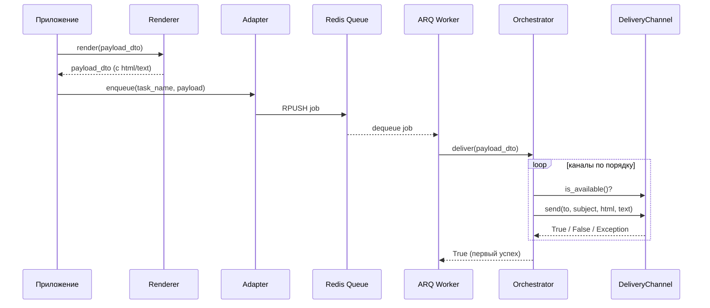

<!-- type: CONCEPT -->

[← Notifications](README.md) | [Главная](../../index.md)

# Data Flow: Notifications

## Жизненный цикл сообщения

1. **Сборка** — код приложения создаёт `NotificationPayloadDTO` с получателем, темой, именем шаблона и контекстными данными.

2. **Рендеринг** — `NotificationRenderer` загружает Jinja2-шаблон, подставляет контекст и заполняет поля `html_content` / `text_content` в DTO.

3. **Постановка в очередь** — вызывается `NotificationAdapter.enqueue()` с сериализованным DTO:
   - `ArqDeliveryAdapter` помещает задачу в Redis-очередь через ARQ.
   - `DirectDeliveryAdapter` немедленно вызывает оркестратор в текущем процессе.

4. **Оркестрация** — `BaseDeliveryOrchestrator.deliver()` перебирает зарегистрированные каналы:
   - Пропускает каналы, где `is_available()` возвращает `False`.
   - Вызывает `channel.send(to, subject, html, text)`.
   - При успехе → возвращает `True`, останавливает перебор.
   - При исключении → логирует, переходит к следующему каналу.
   - Если все каналы исчерпаны → логирует ошибку, возвращает `False`.

5. **Подтверждение** — при доставке через ARQ воркер отмечает задачу выполненной. Для прямой доставки подтверждение не требуется.

## Диаграмма последовательности

## Пути ошибок

| Точка отказа | Поведение |
| :--- | :--- |
| Renderer бросает исключение | Проброс к вызывающему — полезная нагрузка никогда не ставится в очередь |
| Adapter бросает исключение | Проброс к вызывающему — инфраструктурная ошибка, нельзя замалчивать |
| Channel бросает исключение | Логируется, следующий канал |
| Все каналы исчерпаны | `deliver()` возвращает `False`, логируется как ошибка |
