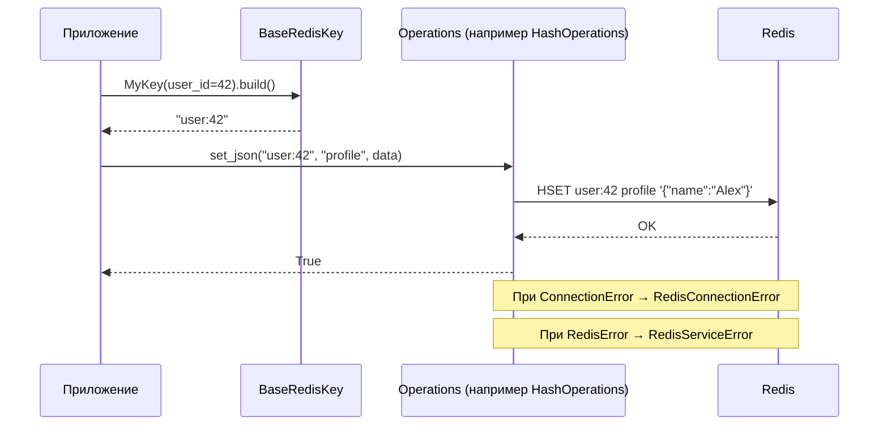
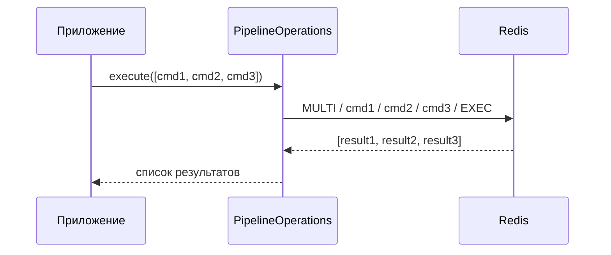

<!-- type: CONCEPT -->

[← Redis Service](README.md) | [Главная](../../index.md)

# Data Flow: Redis Service

## Жизненный цикл операции

1. **Построение ключа** — вызывающий код создаёт типизированный ключ через подкласс `BaseRedisKey`. Строка ключа валидируется при создании.

2. **Вызов операции** — вызывается метод на соответствующем объекте операций (например, `service.hash.set_json(key, field, data)`).

3. **Сериализация** — для методов, работающих с JSON, операция сериализует Python-объекты в JSON-строки перед записью в Redis.

4. **Redis-вызов** — операция выполняет базовую корутину `redis-py` (`hset`, `set`, `xadd` и т.д.).

5. **Обработка ошибок** — любой `ConnectionError` / `TimeoutError` поднимает `RedisConnectionError`; другие `RedisError` поднимают `RedisServiceError`. Сырые исключения не проникают к вызывающему.

6. **Десериализация** — при чтении операция десериализует сырые байты/строки Redis обратно в Python-типы.

## Диаграмма последовательности

## Pipeline Flow

Для атомарных пакетов из нескольких операций `PipelineOperations` собирает команды и отправляет их за один round-trip:

