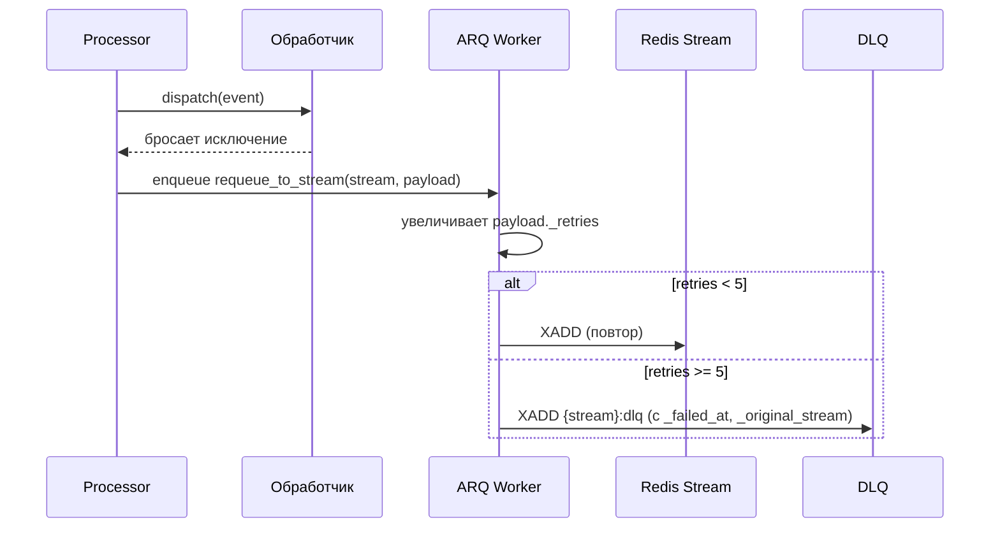
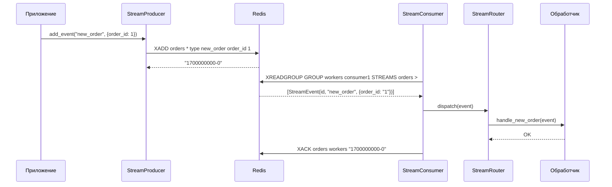

<!-- type: CONCEPT -->

[← Streams](README.md) | [Главная](../../index.md)

# Data Flow: Streams

## Поток производителя

1. Приложение формирует данные события в виде Python-словаря.
2. `StreamProducer.add_event(event_type, data)` санитизирует payload (все значения → `str`, `None` фильтруются, поле `type` добавляется).
3. Отправляется `XADD {stream_name} * type {event_type} ...поля` в Redis.
4. Redis возвращает ID события (`{timestamp}-{seq}`).

## Поток потребителя

1. При старте `StreamConsumer.ensure_group()` вызывает `XGROUP CREATE` (идемпотентно — пропускает, если группа существует).
2. `StreamConsumer.read(count)` вызывает `XREADGROUP GROUP {group} {consumer} COUNT {count} STREAMS {stream} >`.
3. Каждое сырое сообщение парсится в `StreamEvent(id, event_type, data)`.
4. `StreamDispatcher` передаёт каждое событие в `StreamRouter.dispatch(event)`.
5. `StreamRouter` находит обработчик по `event.event_type` и вызывает его.
6. При успехе → `StreamConsumer.ack(event.id)` → `XACK`.

## Поток повторов / DLQ

## Полная последовательность

