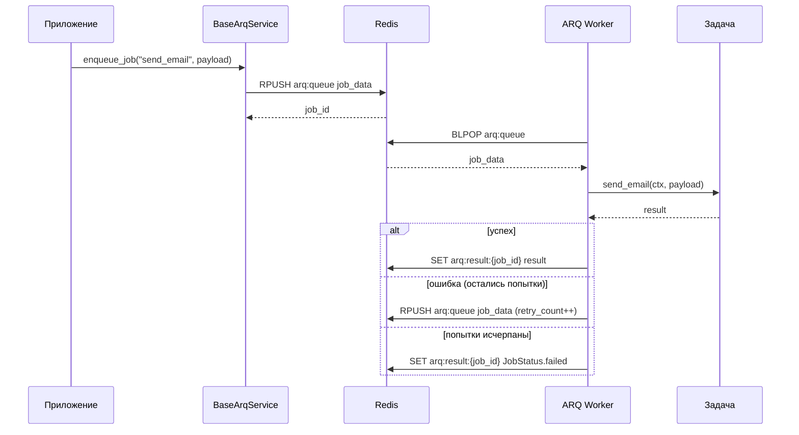
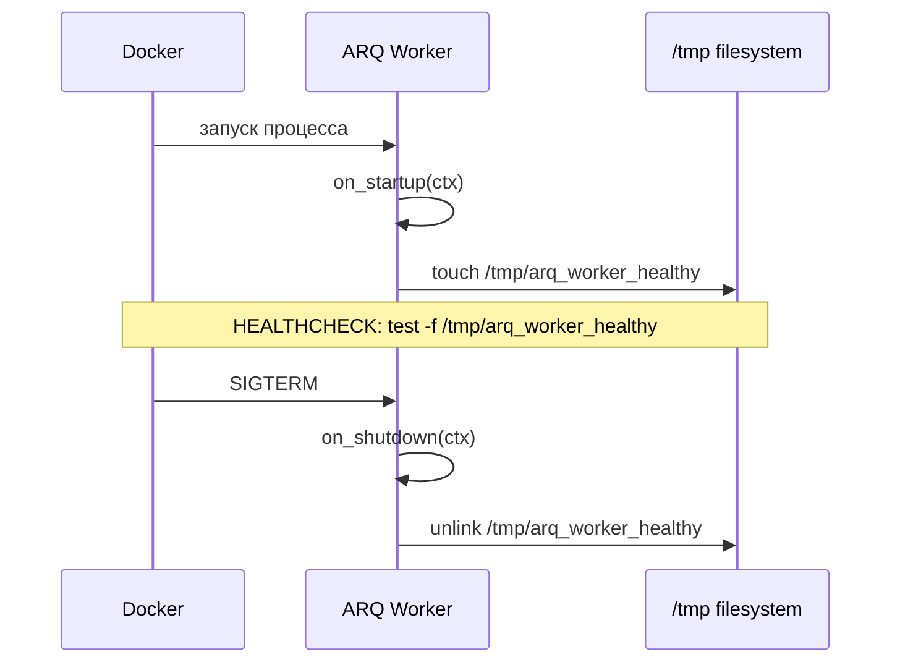

<!-- type: CONCEPT -->

[← Workers](README.md) | [Главная](../../index.md)

# Data Flow: Workers (ARQ)

## Жизненный цикл задачи

1. **Постановка в очередь** — код приложения (или другой воркер) вызывает `BaseArqService.enqueue_job(function_name, *args)`. Задача записывается в Redis.

2. **Извлечение** — ARQ-воркер опрашивает Redis и извлекает задачу для зарегистрированной функции.

3. **Выполнение** — функция-задача запускается с ARQ `ctx`-словарём, инжектированным первым аргументом. `ctx` содержит Redis pool и все объекты, зарегистрированные в `on_startup`.

4. **Успех** — ARQ помечает результат задачи как выполненный и опционально хранит его `keep_result` секунд.

5. **Ошибка** — ARQ повторяет задачу до `max_retries` раз с паузой `retry_delay` секунд между попытками. После исчерпания `max_retries` задача помечается как упавшая.

## Диаграмма последовательности

## Startup / Shutdown

## Интеграция с повторами Streams

Когда обработчик Streams падает, `StreamProcessor` ставит в очередь `requeue_to_stream` как ARQ-задачу. Эта функция увеличивает `_retries` в payload и повторно вставляет событие в исходный стрим (или в DLQ после 5 попыток).

Полная последовательность повторов — в [Streams Data Flow](../streams/data_flow.md).
